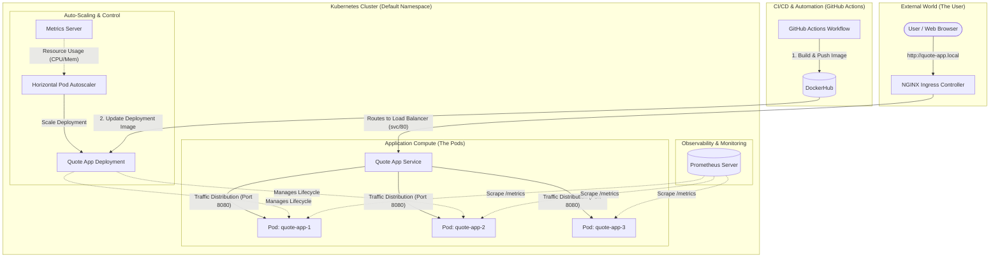

# Project Architecture: Cloud-Native Mastery

This document outlines the technical structure and traffic flow of the Kubernetes ecosystem for the Quote App.

---

## 🗺️ Technical Architecture Diagram
This diagram shows the relationship between the users, the ingress controller, the application services, the scaling controller, and the monitoring system.

---

## 🔍 Detailed Component Flow

### 1. Traffic Routing (Ingress to Pod)
*   **User** → Hits the **NGINX Ingress Controller** (Port 80/443).
*   **Ingress** → Routes the request to the internal **ClusterIP Service**.
*   **Service** → A virtual IP that balances requests across the available healthy **Pods**.

### 2. The Auto-Scaling Loop (HPA)
*   **Metrics Server** → Periodically scrapes CPU and Memory usage from the container runtime (Kubelet).
*   **HPA** → Compares the current usage against the **30% CPU Target**.
*   **Deployment** → Adds or removes replicas to maintain the desired state.

### 3. Monitoring (Prometheus)
*   **Prometheus** → Automatically discovers our pods (via annotations) and pulls raw data from the `/metrics` endpoint.
*   **Data** → Can be used for alerting and visualization in Grafana.

### 4. Continuous Deployment (CI/CD)
*   **GitHub Actions** → Builds the [Dockerfile](file:///c:/Users/shaun/Documents/Projects/k8s-concepts/Dockerfile), pushes to **DockerHub**, and updates the cluster using the unique commit SHA.
