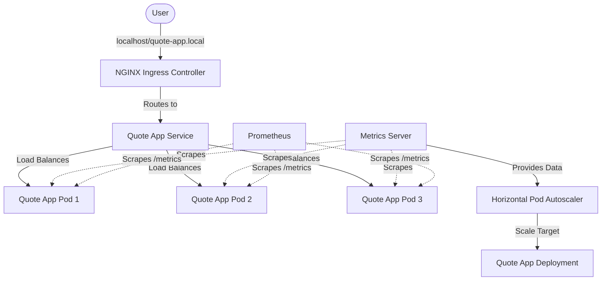

# Deep-Dive Technical Walkthrough: Cloud-Native Mastery

## 🏗️ 1. High-Level Architecture
The following diagram illustrates how your application interacts with the Kubernetes ecosystem:

---

## 💻 2. The Application Layer (Go & Prometheus)
The backend is written in **Go (Golang)**, chosen for its efficiency and native support for concurrency and HTTP handling.

### Key Logic in `main.go`:
-   **Metric Instrumentation**: We use the `github.com/prometheus/client_golang/prometheus/promhttp` package to expose a `/metrics` endpoint. This allows Prometheus to periodically "scrape" information like HTTP request counts, CPU time, and memory overhead directly from the running process.
-   **Static File Serving**: The app uses `http.FileServer` to serve the HTML/JS frontend located in `./static`. This keeps the application small and self-contained.

---

## 🐳 3. Containerization (Docker Multi-Stage)
We use a **Multi-Stage Build** in the [Dockerfile](file:///c:/Users/shaun/Documents/Projects/k8s-concepts/Dockerfile) to ensure a secure, lightweight final image.

1.  **Build Stage**: Uses `golang:1.21-alpine` to compile the Go code. We set `CGO_ENABLED=0` to ensure the binary is statically linked and doesn't rely on external libraries.
2.  **Final Stage**: Uses a minimal `alpine:latest` image. We **only** copy the compiled binary and the static assets.
    *   **Benefit**: The final image is ~20MB instead of ~500MB, significantly reducing the attack surface and increasing deployment speed.

---

## ☸️ 4. Orchestration Layer (Kubernetes)
The infrastructure is defined as **Infrastucture as Code (IaC)** using YAML manifests.

### [Deployment](file:///c:/Users/shaun/Documents/Projects/k8s-concepts/k8s/deployment.yaml)
*   **Strategy**: Uses a `RollingUpdate` strategy. This ensures that old pods are only terminated *after* new pods are healthy, achieving zero downtime.
*   **Resource Limits**: We specify `requests` (minimum needed) and `limits` (maximum allowed). This is critical for the HPA to calculate "Utilization Percentage."

### [Service](file:///c:/Users/shaun/Documents/Projects/k8s-concepts/k8s/service-rs.yaml)
*   Acts as a stable DNS name and load balancer for the pods. Even if pods are restarted and get new IP addresses, the service IP remains constant.

---

## 🚦 5. Traffic Control (NGINX Ingress)
Instead of using complex NodePorts or expensive LoadBalancers for every service, we use a single **Ingress Controller**.

-   **Ingress Class**: `nginx`.
-   **Routing Rule**: Any request coming to `quote-app.local` is routed to port 80 of the `quote-app-service`.
-   **Efficiency**: Allows multiple applications to share a single entry point (the Ingress Controller).

---

## 📈 6. Scaling Layer (HPA & Metrics Server)
This is where the application becomes "Elastic."

-   **Metrics Server**: It must be running in the cluster. It talks to the `Kubelet` on each node to gather resource usage metrics.
-   **HPA Logic**: Every 15 seconds, the HPA checks the average CPU usage of all pods. If it's above **30%**, it adds more replicas (up to 10). When traffic slows down, it removes replicas (down to 2).

---

## 🔄 7. CI/CD Pipeline (GitHub Actions)
The [deploy.yml](file:///c:/Users/shaun/Documents/Projects/k8s-concepts/.github/workflows/deploy.yml) workflow automates the entire lifecycle:

1.  **Checkout**: Pulls the latest code.
2.  **Auth (OIDC)**: Uses OpenID Connect to securely authenticate with AWS/EKS without long-lived secret keys (Security best practice).
3.  **Build & Push**: Builds the Docker image and tags it with both `latest` and the unique commit SHA.
4.  **Deploy**: Updates the Kubernetes image tag. This triggers the Rolling Update in K8s.

---

## 👁️ 8. Observability Layer (Monitoring)
[Prometheus](file:///c:/Users/shaun/Documents/Projects/k8s-concepts/k8s/monitoring/prometheus.yaml) is configured to automatically discover our services.

-   **Service Discovery**: Prometheus looks for the annotation `prometheus.io/scrape: "true"` in our pod metadata.
-   **Scrape Interval**: Every 15 seconds, Prometheus fetches metrics, allowing us to see real-time performance graphs and alert on failures.

---

## 🏁 Summary for the Team
This architecture represents a modern, resilient, and fully automated cloud-native stack. By separating concerns (App, Container, Orchestration, CI/CD), we enable developers to focus on features while the platform handles stability and scale.
